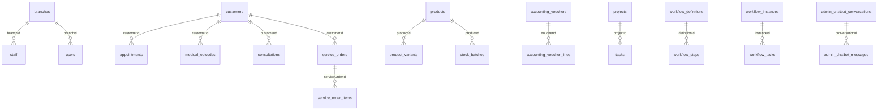

# Database schema (developer reference)

Tài liệu này là sơ đồ dữ liệu ở mức phát triển, **không hiển thị trong CMS**.
Nguồn chuẩn của schema là [`backend/src/entities/entities.ts`](../backend/src/entities/entities.ts); danh sách bên dưới phản ánh mã nguồn hiện tại.

## Xem nhanh trong mã nguồn

Chạy từ thư mục gốc của repo:

```bash
# Danh sách toàn bộ bảng/entity
rg -n "@Entity\\(" backend/src/entities/entities.ts

# Xem các cột của một bảng (ví dụ Customer)
rg -n -A 55 "export class Customer" backend/src/entities/entities.ts

# Tìm nơi một khóa tham chiếu được dùng
rg -n "customerId" backend/src
```

Mỗi tenant sử dụng data source riêng. TypeORM đọc các entity trên để đồng bộ schema trong môi trường development; khi thay đổi cấu trúc, cần bổ sung migration theo quy trình deploy production của dự án.

## Quy ước chung

- Phần lớn nghiệp vụ kế thừa `ConfigurableEntity`: `id` (UUID), `createdAt`, `updatedAt`, `isArchived` và dữ liệu `customFields`.
- Các trường như `branchId`, `customerId`, `staffId`… là khóa liên kết nghiệp vụ. Hiện chúng được lưu dưới dạng ID, không phải tất cả đều khai báo foreign key TypeORM.
- `custom_field_definitions` định nghĩa field động; giá trị của record nằm trong `customFields` hoặc `custom_field_values` tùy loại record.
- Tất cả tên bảng dưới đây là tên vật lý trong database.

## Sơ đồ quan hệ nghiệp vụ chính



Đây là quan hệ logic để tra cứu nhanh; cột thực tế và các điều kiện ràng buộc phải xem trong entity nguồn.

## Danh sách bảng theo nghiệp vụ

### Nền tảng, phân quyền và cơ sở

| Bảng | Entity | Vai trò |
| --- | --- | --- |
| `branches` | `Branch` | Chi nhánh |
| `users` | `User` | Tài khoản và phân quyền chính |
| `dynamic_role_definitions` | `DynamicRoleDefinition` | Vai trò tùy biến |
| `branch_permissions` | `BranchPermission` | Quyền theo chi nhánh |
| `departments` | `Department` | Phòng ban |
| `rooms` | `Room` | Phòng khám/phòng làm việc |
| `equipments` | `Equipment` | Thiết bị |
| `units` | `Unit` | Đơn vị tính |
| `item_categories` | `ItemCategory` | Nhóm hàng/dịch vụ |
| `location_countries` | `LocationCountry` | Quốc gia |
| `location_provinces` | `LocationProvince` | Tỉnh/thành |
| `location_wards` | `LocationWard` | Phường/xã |

### CRM và giao tiếp khách hàng

| Bảng | Entity | Liên kết đáng chú ý |
| --- | --- | --- |
| `customers` | `Customer` | Hồ sơ khách hàng/bệnh nhân |
| `leads` | `Lead` | Khách hàng tiềm năng |
| `lead_activities` | `LeadActivity` | `leadId` |
| `zalo_accounts` | `ZaloAccount` | Tài khoản Zalo OA |
| `zalo_conversations` | `ZaloConversation` | Hội thoại Zalo |
| `zalo_messages` | `ZaloMessage` | `conversationId` |
| `customer_images` | `CustomerImage` | `customerId` |

### Khám chữa bệnh, lịch và dịch vụ

| Bảng | Entity | Liên kết đáng chú ý |
| --- | --- | --- |
| `staff` | `Staff` | Nhân sự/bác sĩ, `branchId`, `departmentId` |
| `medical_episodes` | `MedicalEpisode` | `customerId` |
| `appointments` | `Appointment` | `customerId`, `staffId`, `branchId` |
| `work_schedules` | `WorkSchedule` | `staffId`, `roomId` |
| `consultations` | `Consultation` | `customerId`, `staffId`, `medicalEpisodeId` |
| `service_orders` | `ServiceOrder` | `customerId`, `medicalEpisodeId` |
| `service_order_items` | `ServiceOrderItem` | `serviceOrderId`, `productId` |
| `treatments` | `Treatment` | Điều trị |
| `commissions` | `Commission` | Hoa hồng |

### Hàng hóa, kho và mua hàng

| Bảng | Entity | Liên kết đáng chú ý |
| --- | --- | --- |
| `suppliers` | `Supplier` | Nhà cung cấp |
| `products` | `Product` | Sản phẩm/dịch vụ |
| `product_variants` | `ProductVariant` | `productId` |
| `stock_batches` | `StockBatch` | `productId`, lô tồn kho |

### Kế toán và tài chính

| Bảng | Entity | Liên kết đáng chú ý |
| --- | --- | --- |
| `invoices` | `Invoice` | Hóa đơn |
| `expenses` | `Expense` | Chi phí |
| `accounting_periods` | `AccountingPeriod` | Kỳ kế toán |
| `accounting_chart_accounts` | `AccountingChartAccount` | Danh mục tài khoản |
| `accounting_fiscal_settings` | `AccountingFiscalSetting` | Thiết lập năm tài chính |
| `accounting_cash_flow_mappings` | `AccountingCashFlowMapping` | Mapping dòng tiền |
| `accounting_vouchers` | `AccountingVoucher` | Chứng từ |
| `accounting_voucher_lines` | `AccountingVoucherLine` | `voucherId`, dòng chứng từ |

### Nhân sự, chấm công và lương

| Bảng | Entity | Liên kết đáng chú ý |
| --- | --- | --- |
| `staff_rewards` | `StaffReward` | `staffId` |
| `staff_trainings` | `StaffTraining` | `staffId` |
| `performance_reviews` | `PerformanceReview` | `staffId` |
| `position_histories` | `PositionHistory` | `staffId` |
| `work_contracts` | `WorkContract` | `staffId` |
| `staff_insurances` | `StaffInsurance` | `staffId` |
| `attendances` | `Attendance` | `staffId` |
| `leave_requests` | `LeaveRequest` | `staffId`, `leaveTypeId` |
| `leave_types` | `LeaveType` | Loại nghỉ |
| `leave_allocations` | `LeaveAllocation` | `staffId`, `leaveTypeId` |
| `payrolls` | `Payroll` | `staffId` |
| `attendance_adjustment_requests` | `AttendanceAdjustmentRequest` | `staffId` |
| `business_trip_requests` | `BusinessTripRequest` | `staffId` |
| `payment_requests` | `PaymentRequest` | Yêu cầu thanh toán |

### Công việc và workflow

| Bảng | Entity | Liên kết đáng chú ý |
| --- | --- | --- |
| `projects` | `Project` | Dự án |
| `tasks` | `Task` | `projectId`, người xử lý |
| `project_members` | `ProjectMember` | `projectId`, `staffId` |
| `workflow_definitions` | `WorkflowDefinition` | Định nghĩa luồng |
| `workflow_steps` | `WorkflowStep` | `definitionId` |
| `workflow_instances` | `WorkflowInstance` | Phiên chạy luồng |
| `workflow_tasks` | `WorkflowTask` | `instanceId` |
| `workflow_actions` | `WorkflowAction` | Hành động workflow |

### Cấu hình động, UI và in ấn

| Bảng | Entity | Vai trò |
| --- | --- | --- |
| `custom_field_definitions` | `CustomFieldDefinition` | Định nghĩa custom field theo resource |
| `custom_field_values` | `CustomFieldValue` | Giá trị custom field |
| `code_generation_settings` | `CodeGenerationSetting` | Công thức sinh mã theo resource |
| `custom_tables` | `CustomTable` | Bảng tùy biến |
| `custom_table_columns` | `CustomTableColumn` | `tableId` |
| `custom_table_rows` | `CustomTableRow` | `tableId` |
| `view_settings` | `ViewSetting` | Thiết lập cách xem dữ liệu |
| `print_templates` | `PrintTemplate` | Mẫu in |
| `app_ui_settings` | `AppUiSetting` | Cấu hình giao diện CMS |

### Landing page, nội dung và file

| Bảng | Entity | Vai trò |
| --- | --- | --- |
| `content_posts` | `ContentPost` | Bài viết |
| `content_news` | `ContentNews` | Tin tức |
| `file_folders` | `FileFolder` | Thư mục file |
| `files` | `ManagedFile` | File quản lý trong CMS |
| `landing_pages` | `LandingPage` | Landing page |
| `landing_domains` | `LandingDomain` | Domain landing |
| `landing_forms` | `LandingForm` | Form landing |
| `landing_form_submissions` | `LandingFormSubmission` | Dữ liệu form gửi lên |
| `landing_theme_settings` | `LandingThemeSetting` | Theme landing |
| `landing_global_settings` | `LandingGlobalSetting` | Cấu hình landing toàn cục |
| `google_drive_connections` | `GoogleDriveConnection` | Kết nối Google Drive |

### Chatbot, nhật ký và dữ liệu tạm

| Bảng | Entity | Liên kết đáng chú ý |
| --- | --- | --- |
| `chatbot_settings` | `ChatbotSetting` | Cấu hình chatbot landing và GISCAT |
| `admin_chatbot_conversations` | `AdminChatbotConversation` | `userId`, phiên chat GISCAT |
| `admin_chatbot_messages` | `AdminChatbotMessage` | `conversationId`, lịch sử tin nhắn |
| `audit_logs` | `AuditLog` | Nhật ký thao tác |
| `record_drafts` | `RecordDraft` | Bản nháp record |

## Các bảng mới cần lưu ý

### `code_generation_settings`

Một dòng cấu hình cho mỗi `resource`. Mặc định hệ thống thêm tiền tố module và số tự tăng sáu ký tự, ví dụ `CUS-{NUMBER:6}` cho khách hàng (`CUS-000001`) và `LEAD-{NUMBER:6}` cho khách tiềm năng. Hệ thống cũng hỗ trợ `{NUMBER_DAY:3}` (đếm lại theo ngày) và `{YMD}`.

### Lịch sử GISCAT

`admin_chatbot_conversations` lưu phiên chat theo `userId`; `admin_chatbot_messages` lưu từng tin nhắn theo `conversationId`, gồm vai trò, nội dung và dữ liệu action nếu có. Khi cần tra cứu lịch sử một user, nối hai bảng qua `conversationId` và lọc `userId` ở bảng conversation.
